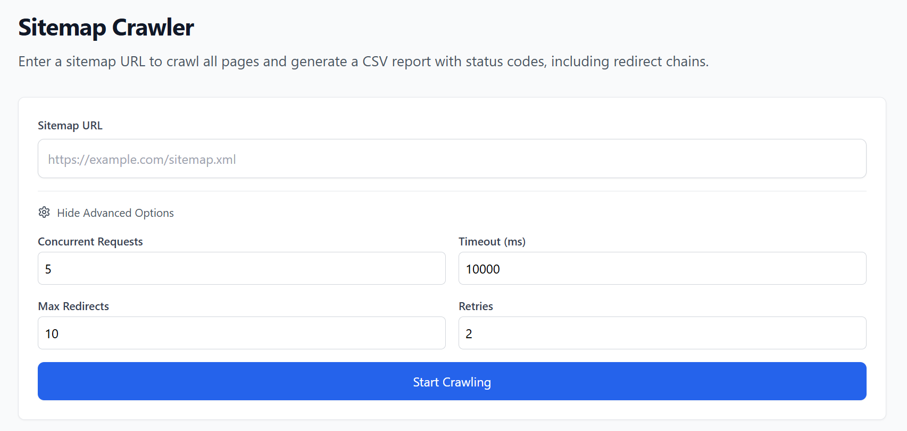

# Sitemap Crawler & SEO Comparison Tool

A modern web application for crawling XML sitemaps and comparing websites across key SEO metrics. Built with React and Node.js, this tool helps you understand your website's URL structure, redirect patterns, and competitive SEO performance.



## Features

### Sitemap Crawler
- 🚀 Crawl entire XML sitemaps with concurrent requests
- 📊 Analyze redirect chains and status codes
- ⏱️ Track response times for each request
- 🔄 Retry individual URLs
- 📝 Export results to CSV
- 🎯 Support for sitemap index files
- 📱 Responsive modern UI with Tailwind CSS

**Advanced Options:**
- Concurrent request limit
- Request timeout
- Maximum redirects
- Retry attempts

### SEO Comparison Tool
- 🔍 Side-by-side website comparison
- 📈 Score websites across 6 key SEO metrics (70 points total)
- ⚠️ Detailed issue breakdown for both sites
- 🚀 Performance analysis (response time, redirects)
- 🔒 HTTPS detection
- 📱 Open Graph tags validation
- 🐦 Share results on Twitter/X

**Scoring Metrics:**
- Title optimization (10 pts)
- Meta description (10 pts)
- Redirect chain (15 pts)
- Response time (15 pts)
- HTTPS (10 pts)
- Open Graph tags (10 pts)

## Tech Stack

- Frontend:
  - React 19
  - React Router
  - Tailwind CSS
  - Lucide Icons

- Backend:
  - Node.js
  - Express
  - Axios
  - xml2js

## Installation

1. Clone the repository:
```bash
git clone https://github.com/yourusername/sitemap-crawler.git
cd sitemap-crawler
```

2. Install dependencies for both frontend and backend:
```bash
# Install backend dependencies
cd backend
npm install

# Install frontend dependencies
cd ../frontend
npm install
```

3. Start the backend server:
```bash
cd backend
node server.js
```

4. Start the frontend development server:
```bash
cd frontend
npm start
```

5. Open your browser and navigate to `http://localhost:3000`

## Usage

### Sitemap Crawler

1. Navigate to the "Sitemap Crawler" tab
2. Enter a sitemap URL (e.g., `https://example.com/sitemap.xml`)
3. (Optional) Configure advanced options:
   - Concurrent Requests: Number of simultaneous requests (1-10)
   - Timeout: Maximum time to wait for each request (in milliseconds)
   - Max Redirects: Maximum number of redirects to follow
   - Retries: Number of retry attempts for failed requests
4. Click "Start Crawling" to begin the analysis
5. View results in the table:
   - URL and metadata from sitemap
   - Complete redirect chains
   - Response times
   - Status codes with descriptions
6. Use the retry button to recheck individual URLs
7. Export results to CSV for further analysis

### SEO Comparison Tool

1. Navigate to the "SEO Comparison" tab
2. Enter two URLs to compare (Site A vs Site B)
3. Click "Compare Sites" to start the analysis
4. Review the comparison results:
   - Overall scores out of 70 points
   - Detailed metric breakdown with progress bars
   - Winner determination
   - Specific issues identified for each site
5. Share results on Twitter/X with the built-in share button

## API Endpoints

### POST /api/crawl
Crawls an entire sitemap

Request body:
```json
{
  "sitemapUrl": "https://example.com/sitemap.xml",
  "concurrency": 5,
  "timeout": 10000,
  "maxRedirects": 10,
  "retries": 2
}
```

### POST /api/crawl-single
Crawls a single URL

Request body:
```json
{
  "url": "https://example.com/page",
  "timeout": 10000,
  "maxRedirects": 10,
  "retries": 2
}
```

### POST /api/battle
Compares two websites across SEO metrics

Request body:
```json
{
  "siteA": "https://example.com",
  "siteB": "https://competitor.com",
  "timeout": 10000
}
```

Response:
```json
{
  "siteA": {
    "url": "https://example.com",
    "chain": [...],
    "score": {
      "total": 65,
      "breakdown": {
        "title": 10,
        "metaDescription": 10,
        "redirects": 15,
        "speed": 10,
        "https": 10,
        "ogTags": 10
      }
    }
  },
  "siteB": { ... },
  "winner": "siteA" | "siteB" | "close" | "tie"
}
```

## Contributing

Contributions are welcome! Please feel free to submit a Pull Request.

1. Fork the repository
2. Create your feature branch (`git checkout -b feature/AmazingFeature`)
3. Commit your changes (`git commit -m 'Add some AmazingFeature'`)
4. Push to the branch (`git push origin feature/AmazingFeature`)
5. Open a Pull Request

## License

This project is licensed under the MIT License - see the [LICENSE](LICENSE) file for details.

## Acknowledgments

- Built with [React](https://reactjs.org/)
- Styled with [Tailwind CSS](https://tailwindcss.com/)
- Icons from [Lucide](https://lucide.dev/) 